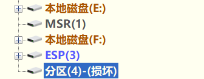

# My Linux Boot Repair Experience - 2025-7-7

[Return to Previous Page](../README-en.md)

> 💡 Background  
> By default, when you install an operating system, an EFI partition is created in a specific location on the disk. The UEFI/BIOS uses this partition to boot the system correctly. However, if you install another OS (e.g., Windows) on the same disk, the new installer may overwrite the existing EFI partition, making the previous OS unbootable. This happened to me – Windows overwrote my Linux bootloader.

## 1. Preparing for Repair

I didn't have a Linux installation medium at hand, so I downloaded the ISO image of my distribution from the official website and wrote it to a USB drive. Then I entered the UEFI/BIOS settings, **disabled Secure Boot and Fast Boot**, saved, rebooted, and booted into the Live environment from the USB drive.

> 💡 If you're using a multi‑system installer like Ventoy and it hangs during normal boot, try the GRUB boot mode.

## 2. Mounting Partitions

In the Live environment, I used `lsblk` and `fdisk -l` to check the disk partitions, identifying which one was my Linux root partition and which was the EFI partition (typically 100–500 MB, with a vfat filesystem). The image below shows the partition layout as seen in DiskGenius:



Then I mounted them:

```bash
mount /dev/nvme0n1p5 /mnt           # mount root partition (adjust to your setup)
mount /dev/nvme0n1p1 /mnt/boot/efi  # mount EFI partition
mount --bind /dev /mnt/dev
mount --bind /proc /mnt/proc
mount --bind /sys /mnt/sys
mount --bind /run /mnt/run
```

(I don't have separate `/home` or `/boot` partitions, so I skipped them. However, after experiencing this boot issue again later – especially after manually installing Arch Linux step by step – I gained a deeper understanding. In fact, on Arch you don't need to mount so many directories; the essential ones like `/dev`, `/proc`, `/sys`, `/run` are automatically mounted for you.)

## 3. Chroot and GRUB Repair

```bash
arch-chroot /mnt   # I use Arch Linux, so this is the command
# Confirm boot mode
[ -d /sys/firmware/efi ] && echo "UEFI" || echo "BIOS"   # output: UEFI
# Reinstall GRUB
grub-install --target=x86_64-efi --efi-directory=/boot/efi --bootloader-id=GRUB
# Generate configuration
grub-mkconfig -o /boot/grub/grub.cfg
```

Exit chroot and reboot:

```bash
exit
reboot
```

## 4. Issues Encountered After Repair

After rebooting, I didn't directly get into Linux – I ran into two common problems.

### Issue 1: Only GRUB Shell

The screen showed a `grub>` prompt with no menu.  
**Solution**: Regenerate the GRUB configuration. I booted into the Live environment again, mounted the partitions, chrooted, and ran `grub-mkconfig -o /boot/grub/grub.cfg`.

### Issue 2: After fixing Issue 1, Only Windows Boot Manager Appeared

After rebooting, the system went straight into Windows; no Linux option was visible.  
**Cause**: The `/boot` directory was missing Linux kernel files (`vmlinuz-linux` and `initramfs` images).  
**Solution**: In the Live environment, after mounting the partitions, I checked `/boot` and `/boot/efi`. The kernel files were actually inside `/boot/efi`. I copied them to `/boot` and then chrooted again to run `grub-mkconfig`.

```bash
cp /mnt/boot/efi/vmlinuz-linux /mnt/boot/
cp /mnt/boot/efi/initramfs-linux.img /mnt/boot/
# chroot again and run grub-mkconfig
```

After these two steps, the GRUB menu finally showed both Linux and Windows entries.

## 5. Final Kernel Panic (QR Code Auto-Repair)

I eagerly chose Linux to boot, but an error appeared, as shown in the image below. There was a **QR code** in the middle of the screen.


Then I pressed Enter to reboot. This time, Linux booted successfully and I reached the desktop!

I later guessed that the QR code was part of my distribution's (or systemd's) built‑in error reporting / automatic repair mechanism. After the countdown ended (or after pressing Enter), the system attempted an emergency recovery and successfully fixed the kernel or initramfs issue. In any case, it saved me from manual troubleshooting.

## 6. Conclusion

From Windows overwriting the bootloader, to GRUB shell, missing kernel, and finally a kernel panic with a QR code auto‑repair – the whole process was winding, but following the standard steps eventually solved everything. If you encounter similar problems, I hope my experience can serve as a reference.